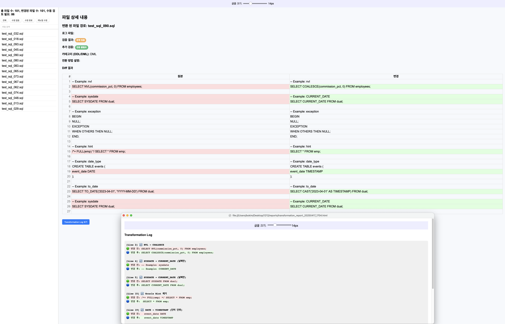
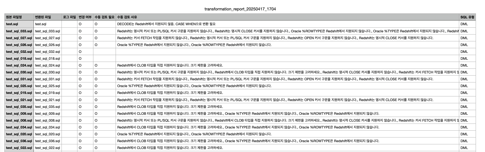

# 🛠 Oracle to Redshift SQL Transformer 

Oracle SQL 스크립트를 Amazon Redshift 호환 SQL로 자동 변환하고, 수동 검토가 필요한 항목을 분류하여 리포트로 제공하는 Python 기반 도구입니다. 
 - Ora2Red 기준 설명입니다.

---

## ✨ 특징
1. 정규식 기반의 규칙 변환 
2. 변환 로그 및 변경 추적
    - 변환 전/후 SQL 간 라인 단위 비교 및 단어 강조(diff) 지원
    - HTML 기반 보고서에 다음 포함
   	- 변환 전/후 SQL 비교
   	- 적용된 규칙 요약
   	- 자동/수동 변환 여부 구분
   	- 변환 항목 필터링 UI 포함
   	- CSV 보고서도 함께 생성

3. 파일 일괄 처리 시스템
    - 지정 된 디렉토리 내 모든 SQL 파일을 자동으로 변환
    - 변환된 SQL 파일은 `converted_sqls/` 디렉토리에 저장
    - 변환 결과는 `reports/` 디렉토리에 저장
    - 변환 로그는 `logs/` 디렉토리에 저장

4. 규칙 JSON 구조화
    - 정규식 pattern, replacement
    - 자동/수동 여부
    - 예제 (example_as_is, example_to_be)
    - 변환 사유 (notes, manual_reason)

## 프로젝트-구조
```
oracle_to_redshift/
├── Ora2Red.py       # 실행 
├── config.py
├── file_processor.py  # SQL 파일 읽기/쓰기 처리
├── sql_transformer.py  # SQL 기반 규칙으로 변환
├── sql_classifier.py
├── report_generator.py  # CSV / HTML 리포트 생성
└── transformations.json
```


## 사용방법
```
% python Ora2Red.py 
디렉토리를 선택하려면 1, 파일을 선택하려면 2를 입력하세요: 1
디렉토리 경로를 입력하세요: .
2025-04-17 17:04:09,448 - INFO - 변환 완료: converted_sqls/DDL/manual_sqls/test_converted.sql [SQL 유형: DDL, 전환 방법: 메뉴얼 변경], 변경 로그: test_converted_log.txt
2025-04-17 17:04:09,450 - INFO - 변환 완료: converted_sqls/DML/manual_sqls/test_sql_033_converted.sql [SQL 유형: DML, 전환 방법: 메뉴얼 변경], 변경 로그: test_sql_033_converted_log.txt
2025-04-17 17:04:09,451 - INFO - 변환 완료: converted_sqls/DDL/manual_sqls/test_sql_027_converted.sql [SQL 유형: DDL, 전환 방법: 메뉴얼 변경], 변경 로그: test_sql_027_converted_log.txt
2025-04-17 17:04:09,452 - INFO - 변환 완료: converted_sqls/DDL/manual_sqls/test_sql_026_converted.sql [SQL 유형: DDL, 전환 방법: 메뉴얼 변경], 변경 로그: test_sql_026_converted_log.txt
2025-04-17 17:04:09,453 - INFO - 변환 완료: converted_sqls/DDL/success_sqls/test_sql_032_converted.sql [SQL 유형: DDL, 전환 방법: 변환 성공], 변경 로그: test_sql_032_converted_log.txt
2025-04-17 17:04:09,558 - INFO - 변환 완료: converted_sqls/DDL/manual_sqls/test_sql_003_converted.sql [SQL 유형: DDL, 전환 방법: 메뉴얼 변경], 변경 로그: test_sql_003_converted_log.txt
2025-04-17 17:04:09,559 - INFO - 변환 완료: converted_sqls/DDL/manual_sqls/test_sql_002_converted.sql [SQL 유형: DDL, 전환 방법: 메뉴얼 변경], 변경 로그: test_sql_002_converted_log.txt
2025-04-17 17:04:09,560 - INFO - 변환 완료: converted_sqls/DDL/manual_sqls/test_sql_016_converted.sql [SQL 유형: DDL, 전환 방법: 메뉴얼 변경], 변경 로그: test_sql_016_converted_log.txt
결과가 JSON으로 저장되었습니다: reports/validation_results.json
CSV 리포트 생성: reports/transformation_report_20250417_1704.csv
HTML 리포트 생성: reports/transformation_report_20250417_1704.html
📊 리포트가 생성되었습니다: reports


./converted_sqls
├── DDL
│   ├── manual_sqls
│   │   ├── test_converted.sql
│   │   ├── test_sql_002_converted.sql
│   │   ├── test_sql_003_converted.sql
│   │   ├── test_sql_004_converted.sql
│   │   ├── test_sql_098_converted.sql
│   │   ├── test_sql_099_converted.sql
│   │   └── test_sql_100_converted.sql
│   ├── nochange_sqls
│   └── success_sqls
│       ├── test_sql_013_converted.sql
│       ├── test_sql_018_converted.sql
│       ├── test_sql_029_converted.sql
│       ├── test_sql_080_converted.sql
│       ├── test_sql_090_converted.sql
│       └── test_sql_093_converted.sql
└── DML
    ├── manual_sqls
    │   ├── test_sql_001_converted.sql
    │   ├── test_sql_017_converted.sql
    │   ├── test_sql_076_converted.sql
    │   └── test_sql_097_converted.sql
    ├── nochange_sqls
    └── success_sqls
        └── test_sql_083_converted.sql

9 directories, 101 files

```
### Reports
 
 


### offline 사용 시


```bash
# offline_packages 디렉토리 구조
MacBookPro offline_packages % ls -alh 
total 34560
drwxr-xr-x@ 10 bokim  staff   320B  4 17 17:11 .
drwxr-xr-x@ 29 bokim  staff   928B  4 17 17:10 ..
-rw-r--r--@  1 bokim  staff    12K  4 17 17:10 MarkupSafe-3.0.2-cp313-cp313-macosx_11_0_arm64.whl
-rw-r--r--@  1 bokim  staff   132K  4 17 17:10 jinja2-3.1.6-py3-none-any.whl
-rw-r--r--@  1 bokim  staff   4.9M  4 17 17:10 numpy-2.2.4-cp313-cp313-macosx_14_0_arm64.whl
-rw-r--r--@  1 bokim  staff    11M  4 17 17:10 pandas-2.2.3-cp313-cp313-macosx_11_0_arm64.whl
-rw-r--r--@  1 bokim  staff   225K  4 17 17:10 python_dateutil-2.9.0.post0-py2.py3-none-any.whl
-rw-r--r--@  1 bokim  staff   497K  4 17 17:10 pytz-2025.2-py2.py3-none-any.whl
-rw-r--r--@  1 bokim  staff    11K  4 17 17:10 six-1.17.0-py2.py3-none-any.whl
-rw-r--r--@  1 bokim  staff   340K  4 17 17:10 tzdata-2025.2-py2.py3-none-any.whl

# 설치 방법 
pip install --no-index --find-links=./offline_packages pandas jinja2
```


## 변환 참고
### Oracle to Redshift SQL 변환 가이드 (자동 변환 우선)

이 문서는 Oracle SQL을 Amazon Redshift로 변환하기 위한 전환 가이드입니다.
자동 변환 가능한 항목이 먼저 정렬되어 있습니다.

| No. | 설명 | 자동 변환 가능 | 중요도 | 적용 대상 | 우선순위 | 변환 전 예제 | 변환 후 예제 | 비고 |
|-----|------|----------------|--------|------------|------------|---------------|---------------|------|
| 1 | TO_DATE → CAST(AS TIMESTAMP) | ✅ 자동 변환 가능 | low | DML | 20 | `SELECT TO_DATE('2024-01-01', 'YYYY-MM-DD') FROM DUAL;` | `SELECT CAST('2024-01-01' AS TIMESTAMP) FROM DUAL;` | 표준 날짜 형식으로 변환 |
| 2 | SYSDATE → CURRENT_DATE (날짜만) | ✅ 자동 변환 가능 | low | DML | 21 | `SELECT SYSDATE FROM DUAL;` | `SELECT CURRENT_DATE FROM DUAL;` | 날짜만 필요할 경우 CURRENT_DATE 사용 |
| 3 | ADD_MONTHS → DATEADD(month, ...) | ✅ 자동 변환 가능 | low | DML | 22 | `SELECT ADD_MONTHS(order_date, 3) FROM orders;` | `SELECT DATEADD(month, 3, order_date) FROM orders;` | 월 단위 날짜 계산 |
| 4 | MONTHS_BETWEEN → DATEDIFF(month, ...) | ✅ 자동 변환 가능 | low | DML | 23 | `SELECT MONTHS_BETWEEN('2024-04-01', '2024-01-01') FROM DUAL;` | `SELECT DATEDIFF(month, '2024-01-01', '2024-04-01') FROM DUAL;` | 두 날짜 간 월 차이 계산 |
| 5 | TRUNC(date, 'MM') → DATE_TRUNC('month', date) | ✅ 자동 변환 가능 | low | DML | 24 | `SELECT TRUNC(order_date, 'MM') FROM orders;` | `SELECT DATE_TRUNC('month', order_date) FROM orders;` | 날짜에서 월 단위를 추출하는 함수 변환 |
| 6 | TRUNC(date) → DATE_TRUNC('day', date) | ✅ 자동 변환 가능 | low | DML | 25 | `SELECT TRUNC(order_date) FROM orders;` | `SELECT DATE_TRUNC('day', order_date) FROM orders;` | 날짜에서 일 단위를 추출하는 함수 변환 |
| 7 | NVL → COALESCE | ✅ 자동 변환 가능 | low | DML | 26 | `SELECT NVL(salary, 0) FROM employees;` | `SELECT COALESCE(salary, 0) FROM employees;` | NULL 처리 함수 NVL을 COALESCE로 변환 |
| 8 | SUBSTR → SUBSTRING | ✅ 자동 변환 가능 | low | DML | 27 | `SELECT SUBSTR(name, 1, 3) FROM users;` | `SELECT SUBSTRING(name, 1, 3) FROM users;` | 부분 문자열 추출 함수 변환 |
| 9 | INSTR → POSITION | ✅ 자동 변환 가능 | low | DML | 28 | `SELECT INSTR('hello world', 'o') FROM dual;` | `SELECT POSITION('o' IN 'hello world') FROM dual;` | 문자 위치 찾기 함수 변환 |
| 10 | CEIL → CEILING | ✅ 자동 변환 가능 | low | DML | 29 | `SELECT CEIL(3.1) FROM dual;` | `SELECT CEILING(3.1) FROM dual;` | 올림 함수 변환 |
| 11 | CASE 사용 중 중첩 구조 → 유지 가능 | ✅ 자동 변환 가능 | low | DML | 30 | `CASE WHEN score >= 90 THEN 'A' ELSE 'B' END` | `CASE WHEN score >= 90 THEN 'A' ELSE 'B' END` | CASE 구문은 Redshift에서도 동일 사용 가능 |
| 12 | WITH clause (서브쿼리 팩터링) → WITH (동일) | ✅ 자동 변환 가능 | low | DML | 31 | `WITH dept_avg AS (SELECT deptno, AVG(sal) FROM emp GROUP BY deptno)` | `WITH dept_avg AS (SELECT deptno, AVG(sal) FROM emp GROUP BY deptno)` | Redshift에서도 WITH 구문 사용 가능 |
| 13 | Oracle TABLESPACE 제거 | ✅ 자동 변환 가능 | low | DDL | 32 | `CREATE TABLE emp (id INT) TABLESPACE users;` | `CREATE TABLE emp (id INT);` | DDL에서 불필요한 TABLESPACE 정보를 제거 |
| 14 | Oracle STORAGE 절 제거 | ✅ 자동 변환 가능 | low | DDL | 33 | `CREATE TABLE emp (id INT) STORAGE (INITIAL 64K NEXT 64K);` | `CREATE TABLE emp (id INT);` | DDL에서 STORAGE 옵션 제거 |
| 15 | Oracle PCTFREE 절 제거 | ✅ 자동 변환 가능 | low | DDL | 34 | `CREATE TABLE emp (id INT) PCTFREE 10;` | `CREATE TABLE emp (id INT);` | DDL에서 PCTFREE 옵션 제거 |
| 16 | Oracle INITRANS 절 제거 | ✅ 자동 변환 가능 | low | DDL | 35 | `` | `` | DDL에서 INITRANS 옵션 제거 |
| 17 | Oracle MAXTRANS 절 제거 | ✅ 자동 변환 가능 | low | DDL | 36 | `` | `` | DDL에서 MAXTRANS 옵션 제거 |
| 18 | NUMBER(1,0) → SMALLINT | ✅ 자동 변환 가능 | low | DDL | 37 | `` | `` | 간단한 숫자 타입 변환 |
| 19 | NUMBER(p,0) where 2 ≤ p ≤ 9 → INTEGER | ✅ 자동 변환 가능 | low | DDL | 38 | `age NUMBER(5,0)` | `age INTEGER` | 숫자 타입 변환: 범위 2-9 |
| 20 | NUMBER(p,0) where 10 ≤ p ≤ 18 → BIGINT | ✅ 자동 변환 가능 | low | DDL | 39 | `` | `` | 숫자 타입 변환: 범위 10-18 |
| 21 | NUMBER(p,s) → DECIMAL | ✅ 자동 변환 가능 | low | DDL | 40 | `price NUMBER(10,2)` | `price DECIMAL(10,2)` | 소수점 숫자 타입 변환 |
| 22 | VARCHAR2 → VARCHAR | ✅ 자동 변환 가능 | low | DDL | 41 | `name VARCHAR2(100)` | `name VARCHAR(100)` | 문자열 타입 변환 |
| 23 | Oracle Hint 제거 | ✅ 자동 변환 가능 | low | DDL, DML | 42 | `SELECT /*+ FULL(emp) */ * FROM emp;` | `SELECT * FROM emp;` | Oracle Hint 제거, 불필요한 힌트를 모두 제거 |
| 24 | SYSDATE → CURRENT_TIMESTAMP | ✅ 자동 변환 가능 | low | DDL, DML | 43 | `SELECT SYSDATE FROM DUAL;` | `SELECT CURRENT_TIMESTAMP FROM DUAL;` | Oracle SYSDATE를 CURRENT_TIMESTAMP로 변환 |
| 25 | SYSTIMESTAMP → CURRENT_TIMESTAMP | ✅ 자동 변환 가능 | low | DDL, DML | 44 | `SELECT SYSTIMESTAMP FROM DUAL;` | `SELECT CURRENT_TIMESTAMP FROM DUAL;` | Oracle SYSTIMESTAMP를 CURRENT_TIMESTAMP로 변환 |
| 26 | DATE → TIMESTAMP (단어 단위) | ✅ 자동 변환 가능 | low | DDL, DML | 45 | `` | `` | DATE 타입을 TIMESTAMP로 변환 |
| 27 | TO_DATE with custom format → MANUAL REVIEW | ❌ 수동 검토 필요 | high | DML | 1 | `SELECT TO_DATE('24-Jan-2024', 'DD-Mon-YYYY') FROM DUAL;` | `-- 수동 검토 필요` | 비표준 날짜 형식 발견 시 반드시 수동 검토 필요 |
| 28 | Oracle 구문 조인(+) → 명시적 JOIN | ❌ 수동 검토 필요 | high | DML | 2 | `SELECT * FROM emp e, dept d WHERE e.deptno = d.deptno(+);` | `-- 수동 변환 필요: LEFT JOIN 사용 필요` | Oracle의 OUTER JOIN을 명시적으로 변환해야 함 |
| 29 | SEQUENCE.NEXTVAL → 수동 변환 | ❌ 수동 검토 필요 | high | DML | 3 | `INSERT INTO emp (id) VALUES (emp_seq.NEXTVAL);` | `-- 수동 변환 필요: IDENTITY 속성 활용 고려` | AUTO_INCREMENT나 row_number() 사용으로 대체 |
| 30 | MERGE INTO → UPSERT 재작성 | ❌ 수동 검토 필요 | high | DML | 4 | `MERGE INTO emp e USING new_emp n ON (e.id = n.id) WHEN MATCHED THEN UPDATE ...` | `-- 수동 변환 필요: UPDATE → INSERT 조합 필요` | MERGE 대신 UPDATE + INSERT 또는 staging 테이블 사용 필요 |
| 31 | CONNECT BY 계층 쿼리 → RECURSIVE CTE | ❌ 수동 검토 필요 | high | DML | 5 | `SELECT * FROM emp START WITH mgr IS NULL CONNECT BY PRIOR empno = mgr;` | `-- 수동 변환 필요: WITH RECURSIVE 작성 필요` | 재귀 CTE (WITH RECURSIVE) 구문으로 작성 필요 |
| 32 | DBMS_OUTPUT.PUT_LINE → RAISE NOTICE or manual logging | ❌ 수동 검토 필요 | high | DML | 6 | `DBMS_OUTPUT.PUT_LINE('처리 완료');` | `-- 수동 변환 필요: RAISE NOTICE '처리 완료';` | 출력 함수 변환은 수동 검토 필요 |
| 33 | CLOB → VARCHAR(MAX) | ❌ 수동 검토 필요 | high | DDL | 7 | `description CLOB` | `description VARCHAR(MAX)` | CLOB을 VARCHAR(MAX)로 변환, 수동 검토 필요 |
| 34 | EXPLICIT CURSOR LOGIC → MANUAL CONVERSION REQUIRED | ❌ 수동 검토 필요 | high | DDL | 8 | `` | `` | 명시적 커서 로직은 수동 변환 필요 |
| 35 | OPEN cursor → comment with manual note | ❌ 수동 검토 필요 | high | DDL | 9 | `` | `` | 커서 OPEN 구문은 수동 변환 필요 |
| 36 | FETCH cursor → comment with manual note | ❌ 수동 검토 필요 | high | DDL | 10 | `` | `` | 커서 FETCH 구문은 수동 변환 필요 |
| 37 | CLOSE cursor → comment with manual note | ❌ 수동 검토 필요 | high | DDL | 11 | `` | `` | 커서 CLOSE 구문은 수동 변환 필요 |
| 38 | %TYPE → MANUAL CONVERSION REQUIRED | ❌ 수동 검토 필요 | high | DDL | 12 | `v_salary employees.salary%TYPE;` | `-- 수동 변환 필요: v_salary DECIMAL(10,2);` | %TYPE 변환은 수동 검토 필요 |
| 39 | %ROWTYPE → MANUAL CONVERSION REQUIRED | ❌ 수동 검토 필요 | high | DDL | 13 | `v_emp employees%ROWTYPE;` | `-- 수동 변환 필요: 명시적 컬럼 정의 필요` | %ROWTYPE 변환은 수동 검토 필요 |
| 40 | PRAGMA or AUTONOMOUS_TRANSACTION → Not supported | ❌ 수동 검토 필요 | high | DDL | 14 | `` | `` | 해당 문법은 지원되지 않으므로 수동 변환 필요 |
| 41 | LONG → VARCHAR(MAX) | ❌ 수동 검토 필요 | high | DDL | 15 | `note LONG` | `note VARCHAR(MAX)` | LONG 타입은 VARCHAR(MAX)로 변환 필요 |
| 42 | RAW → BYTEA 또는 VARCHAR | ❌ 수동 검토 필요 | high | DDL | 16 | `data RAW(2000)` | `data VARCHAR(2000)` | RAW는 Redshift에서 직접 지원되지 않음. 인코딩 처리 필요 |
| 43 | NUMBER(p,0) where p ≥ 19 → MANUAL REVIEW | ❌ 수동 검토 필요 | high | DDL, DML | 17 | `age NUMBER(5,0)` | `age INTEGER` | 숫자 타입의 정밀도가 높아 수동 검토 필요 |
| 44 | EXCEPTION block → MANUAL REVIEW | ❌ 수동 검토 필요 | high | DDL, DML | 18 | `` | `` | 예외 처리 블록은 수동 변환 필요 |
| 45 | DECODE → CASE WHEN 구문 | ❌ 수동 검토 필요 | medium | DML | 19 | `SELECT DECODE(status, 'A', 'Active', 'I', 'Inactive', 'Unknown') FROM dual;` | `SELECT CASE status WHEN 'A' THEN 'Active' WHEN 'I' THEN 'Inactive' ELSE 'Unknown' END FROM dual;` | 단순 조건 분기 로직은 CASE WHEN으로 재작성 가능 |
